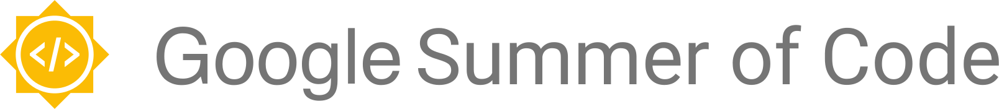
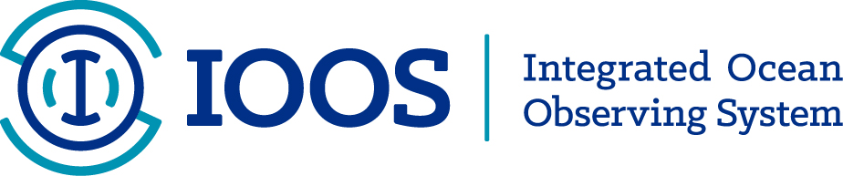

# Google Summer of Code

&nbsp;&nbsp;&nbsp;&nbsp;&nbsp;&nbsp;&nbsp;&nbsp;&nbsp;&nbsp; 

### U.S. IOOS Mission
To produce, integrate, and communicate high quality ocean, coastal and Great Lakes information that meets the safety, economic, and stewardship needs of the Nation.

The Integrated Ocean Observing System (IOOS®) is a national-regional partnership working to provide new tools and forecasts to improve safety, enhance the economy, and protect our environment. Integrated ocean information is available in near real time, as well as retrospectively. Easier and better access to this information is improving our ability to understand and predict coastal events - such as storms, wave heights, and sea level change. Such knowledge is needed for everything from retail to development planning.

For more information visit: [https://ioos.noaa.gov](https://ioos.noaa.gov).

### Information about IOOS' activities for Google Summer of Code
The US IOOS Organization has submitted an application to GSoC 2021.  IOOS maintains several open source packages for oceanographic data management that are used both within the IOOS community as well as by ocean observation organizations worldwide.

**View the 2022 IOOS GSoC project ideas list here: https://github.com/ioos/gsoc/blob/master/2022/ideas-list.md**

The [IOOS Data Management and Cyberinfrastructure](https://ioos.noaa.gov/project/dmac/) (DMAC) community is a coalition of scientific software developers focused on developing and supporting software used within our community and also by other NOAA and US Federal Government offices and international organizations to deliver earth science data to their users.  The DMAC community is an active coalition of both public and private participants contributing to this effort.

We host annual DMAC [data management meetings](https://ioos.noaa.gov/project/dmac/), [code sprints](https://www.glos.us/code-sprint/) (2019, 2022 - planned), monthly technical webinars, and maintain virtual communications through our ['ioos_tech'](https://groups.google.com/g/ioos_tech) mailing list and other platforms such as Slack and of course GitHub.
